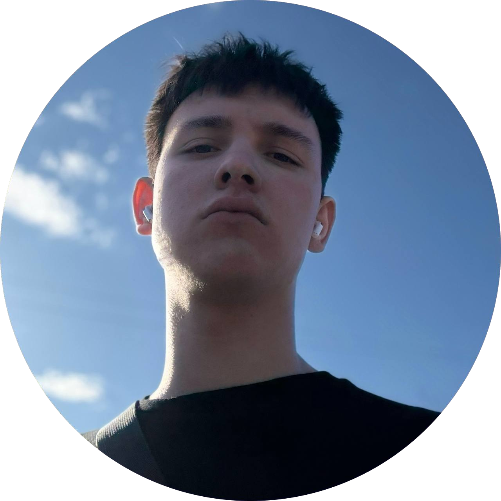

# Artem Makarenko
### _Frontend beginner_

## Personal Information

## About Me
#### EN
I'm a 19-year-old junior web developer with a passion for problem solving and technology. I like to learn and develop myself. I'm interested in collaborating on web development projects. In my free time, I listen to music with headphones while wandering around the dark city.
#### UA
я 19-річний початковий веб-розробник, який захоплюється вирішенням проблем та технологіями. Люблю вчитися та саморозвиватися. Зацікавлений у співпраці над проектами з веб-розробки. У вільний час я слухаю музику в навушниках, блукаючи темним містом.

## Skills

### UI Design

 
 

## My Github Stats

 

## Languages
-   UA | Ukraine, _Fluent_
-   US | English, _Pre-Intermediate_

 

